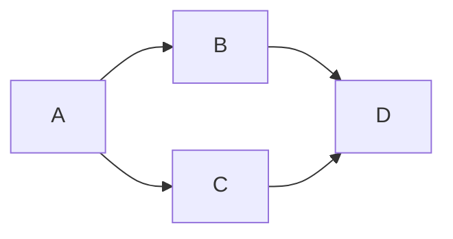

Title: Richard Markdown Test Book
date: 2022-04-22
##############

:tags: test
:category: troubleshooting
:slug: my-super-post
:author: Richard Blanchette
:summary: Short version for index and feeds


# Richard Markdown Test Book

Thanks for visiting [The Markdown Guide](https://www.markdownguide.org)!

This Markdown cheat sheet provides a quick overview of all the Markdown syntax elements. It can’t cover every edge case, so if you need more information about any of these elements, refer to the reference guides for [basic syntax](https://www.markdownguide.org/basic-syntax) and [extended syntax](https://www.markdownguide.org/extended-syntax).

## Basic Syntax

These are the elements outlined in John Gruber’s original design document. All Markdown applications support these elements.

### Heading

# H1

## H2

### H3

### Bold

**bold text**

### Italic

*italicized text*

### Blockquote

> blockquote

### Ordered List

1. First item
2. Second item
3. Third item

### Unordered List

- First item
- Second item
- Third item

### Code

`code`

### Horizontal Rule

- - - - - -

### Link

[Markdown Guide](https://www.markdownguide.org)

### Image


## Extended Syntax

These elements extend the basic syntax by adding additional features. Not all Markdown applications support these elements.

### Table

<table id="bkmrk-syntax-description-h"><thead><tr><th>Syntax</th><th>Description</th></tr></thead><tbody><tr><td>Header</td><td>Title</td></tr><tr><td>Paragraph</td><td>Text</td></tr></tbody></table>

### Fenced Code Block

```
{
  "firstName": "John",
  "lastName": "Smith",
  "age": 25
}

```

### Footnote

Here's a sentence with a footnote. \[^1\]

\[^1\]: This is the footnote.

### Heading ID

### My Great Heading {#custom-id}

### Definition List

term : definition

### Strikethrough

<s>The world is flat.</s>

### Task List

- <input checked="checked" disabled="disabled" type="checkbox"></input> Write the press release
- <input disabled="disabled" type="checkbox"></input> Update the website
- <input disabled="disabled" type="checkbox"></input> Contact the media# Markdown-it

# Source: [https://markdown-it.github.io/](https://markdown-it.github.io/)

<link href="/path/to/markdown.css" id="bkmrk-" rel="stylesheet"></link>- - - - - -

**Advertisement :)**

- **[pica](https://nodeca.github.io/pica/demo/)** - high quality and fast image resize in browser.
- **[babelfish](https://github.com/nodeca/babelfish/)** - developer friendly i18n with plurals support and easy syntax.

You will like those projects!

- - - - - -

# h1 Heading 8-)

## h2 Heading

### h3 Heading

#### h4 Heading

##### h5 Heading

###### h6 Heading

## Horizontal Rules

- - - - - -

- - - - - -

- - - - - -

## Typographic replacements

Enable typographer option to see result.

(c) (C) (r) (R) (tm) (TM) (p) (P) +-

test.. test... test..... test?..... test!....

!!!!!! ???? ,, -- ---

"Smartypants, double quotes" and 'single quotes'

## Emphasis

**This is bold text**

**This is bold text**

*This is italic text*

*This is italic text*

<s>Strikethrough</s>

## Blockquotes

> Blockquotes can also be nested...
> 
> > ...by using additional greater-than signs right next to each other...
> > 
> > > ...or with spaces between arrows.

## Lists

Unordered

- Create a list by starting a line with `+`, `-`, or `*`
- Sub-lists are made by indenting 2 spaces: 
    - Marker character change forces new list start: 
        - Ac tristique libero volutpat at
        
        
        - Facilisis in pretium nisl aliquet
        
        
        - Nulla volutpat aliquam velit
- Very easy!

Ordered

1. Lorem ipsum dolor sit amet
2. Consectetur adipiscing elit
3. Integer molestie lorem at massa
4. You can use sequential numbers...
5. ...or keep all the numbers as `1.`

Start numbering with offset:

57. foo
58. bar

## Code

Inline `code`

Indented code

```
// Some comments
line 1 of code
line 2 of code
line 3 of code

```

Block code "fences"

```
Sample text here...

```

Syntax highlighting

```js
var foo = function (bar) {
  return bar++;
};

console.log(foo(5));

```

## Tables

<table id="bkmrk-option-description-d"><thead><tr><th>Option</th><th>Description</th></tr></thead><tbody><tr><td>data</td><td>path to data files to supply the data that will be passed into templates.</td></tr><tr><td>engine</td><td>engine to be used for processing templates. Handlebars is the default.</td></tr><tr><td>ext</td><td>extension to be used for dest files.</td></tr></tbody></table>

Right aligned columns

<table id="bkmrk-option-description-d-0"><thead><tr><th align="right">Option</th><th align="right">Description</th></tr></thead><tbody><tr><td align="right">data</td><td align="right">path to data files to supply the data that will be passed into templates.</td></tr><tr><td align="right">engine</td><td align="right">engine to be used for processing templates. Handlebars is the default.</td></tr><tr><td align="right">ext</td><td align="right">extension to be used for dest files.</td></tr></tbody></table>

## Links

[link text](http://dev.nodeca.com)

[link with title](http://nodeca.github.io/pica/demo/ "title text!")

Autoconverted link https://github.com/nodeca/pica (enable linkify to see)

## Images


Like links, Images also have a footnote style syntax


With a reference later in the document defining the URL location:

## Plugins

The killer feature of `markdown-it` is very effective support of [syntax plugins](https://www.npmjs.org/browse/keyword/markdown-it-plugin).

### [Emojies](https://github.com/markdown-it/markdown-it-emoji)

Classic markup: :wink: :crush: :cry: :tear: :laughing: :yum:

Shortcuts (emoticons): :-) :-( 8-) ;)

see [how to change output](https://github.com/markdown-it/markdown-it-emoji#change-output) with twemoji.

### [Subscript](https://github.com/markdown-it/markdown-it-sub) / [Superscript](https://github.com/markdown-it/markdown-it-sup)

- 19^th^
- H~2~O

### [&lt;ins&gt;](https://github.com/markdown-it/markdown-it-ins)

++Inserted text++

### [&lt;mark&gt;](https://github.com/markdown-it/markdown-it-mark)

==Marked text==

### [Footnotes](https://github.com/markdown-it/markdown-it-footnote)

Footnote 1 link\[^first\].

Footnote 2 link\[^second\].

Inline footnote^\[Text of inline footnote\] definition.

Duplicated footnote reference\[^second\].

\[^first\]: Footnote **can have markup**

```
and multiple paragraphs.

```

\[^second\]: Footnote text.

### [Definition lists](https://github.com/markdown-it/markdown-it-deflist)

Term 1

: Definition 1 with lazy continuation.

Term 2 with *inline markup*

: Definition 2

```
    { some code, part of Definition 2 }

Third paragraph of definition 2.

```

*Compact style:*

Term 1 ~ Definition 1

Term 2 ~ Definition 2a ~ Definition 2b

### [Abbreviations](https://github.com/markdown-it/markdown-it-abbr)

This is HTML abbreviation example.

It converts "HTML", but keep intact partial entries like "xxxHTMLyyy" and so on.

\*\[HTML\]: Hyper Text Markup Language

### [Custom containers](https://github.com/markdown-it/markdown-it-container)

::: warning *here be dragons*:::# New PageDiagrams

# Charting Demos

## About

This a collection of possible diagram generation tools

## Diagrams

### Mermaid

- https://mermaid-js.github.io/mermaid/#/n00b-gettingStarted
- https://mermaid.live/



[](https://mermaid.live/edit/#eyJjb2RlIjoiZ3JhcGggTFI7XG4gICAgQS0tPkI7XG4gICAgQS0tPkM7XG4gICAgQi0tPkQ7XG4gICAgQy0tPkQ7IiwibWVybWFpZCI6IntcbiAgXCJ0aGVtZVwiOiBcImRhcmtcIlxufSIsInVwZGF0ZUVkaXRvciI6ZmFsc2UsImF1dG9TeW5jIjp0cnVlLCJ1cGRhdGVEaWFncmFtIjpmYWxzZX0)

### Vega-Lite

- https://vega.github.io/vega/examples/

```vega-lite
{
  "$schema": "https://vega.github.io/schema/vega/v5.json",
  "description": "A basic line chart example.",
  "width": 500,
  "height": 200,
  "padding": 5,

  "signals": [
    {
      "name": "interpolate",
      "value": "linear",
      "bind": {
        "input": "select",
        "options": [
          "basis",
          "cardinal",
          "catmull-rom",
          "linear",
          "monotone",
          "natural",
          "step",
          "step-after",
          "step-before"
        ]
      }
    }
  ],

  "data": [
    {
      "name": "table",
      "values": [
        {"x": 0, "y": 28, "c":0}, {"x": 0, "y": 20, "c":1},
        {"x": 1, "y": 43, "c":0}, {"x": 1, "y": 35, "c":1},
        {"x": 2, "y": 81, "c":0}, {"x": 2, "y": 10, "c":1},
        {"x": 3, "y": 19, "c":0}, {"x": 3, "y": 15, "c":1},
        {"x": 4, "y": 52, "c":0}, {"x": 4, "y": 48, "c":1},
        {"x": 5, "y": 24, "c":0}, {"x": 5, "y": 28, "c":1},
        {"x": 6, "y": 87, "c":0}, {"x": 6, "y": 66, "c":1},
        {"x": 7, "y": 17, "c":0}, {"x": 7, "y": 27, "c":1},
        {"x": 8, "y": 68, "c":0}, {"x": 8, "y": 16, "c":1},
        {"x": 9, "y": 49, "c":0}, {"x": 9, "y": 25, "c":1}
      ]
    }
  ],

  "scales": [
    {
      "name": "x",
      "type": "point",
      "range": "width",
      "domain": {"data": "table", "field": "x"}
    },
    {
      "name": "y",
      "type": "linear",
      "range": "height",
      "nice": true,
      "zero": true,
      "domain": {"data": "table", "field": "y"}
    },
    {
      "name": "color",
      "type": "ordinal",
      "range": "category",
      "domain": {"data": "table", "field": "c"}
    }
  ],

  "axes": [
    {"orient": "bottom", "scale": "x"},
    {"orient": "left", "scale": "y"}
  ],

  "marks": [
    {
      "type": "group",
      "from": {
        "facet": {
          "name": "series",
          "data": "table",
          "groupby": "c"
        }
      },
      "marks": [
        {
          "type": "line",
          "from": {"data": "series"},
          "encode": {
            "enter": {
              "x": {"scale": "x", "field": "x"},
              "y": {"scale": "y", "field": "y"},
              "stroke": {"scale": "color", "field": "c"},
              "strokeWidth": {"value": 2}
            },
            "update": {
              "interpolate": {"signal": "interpolate"},
              "strokeOpacity": {"value": 1}
            },
            "hover": {
              "strokeOpacity": {"value": 0.5}
            }
          }
        }
      ]
    }
  ]
}

```

## Flowchart.js

- https://flowchart.js.org/

```flowchart
st=>start: Start:>http://www.google.com[blank]
e=>end:>http://www.google.com
op1=>operation: My Operation
sub1=>subroutine: My Subroutine
cond=>condition: Yes
or No?:>http://www.google.com
io=>inputoutput: catch something...
para=>parallel: parallel tasks

st->op1->cond
cond(yes)->io->e
cond(no)->para
para(path1, bottom)->sub1(right)->op1
para(path2, top)->op1

```